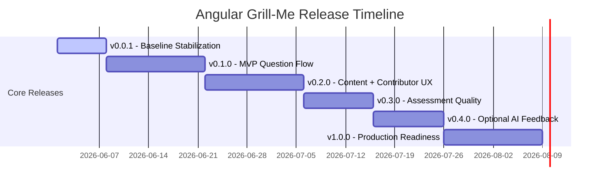

# Product Roadmap & Architectural Delivery Plan

This document defines the structured roadmap for **Angular Grill-Me**, evolving it from a prototype assessment app into a secure, accessible, high-validity knowledge-sharing platform.

---

## 🎯 Vision

Angular Grill-Me helps learners prepare for technical interviews by combining:
- reliable, data-driven assessment content,
- clear review and remediation guidance,
- a contributor-friendly topic registry,
- optional AI feedback that never replaces core scoring,
- a production-ready experience with accessibility and offline support.

Success means users can complete a topic quiz, understand where they need improvement, and contributors can safely extend the platform without touching core rendering logic.

---

## 🏗️ Architecture Principles

The app is organized into four clean layers so functionality can evolve safely:

1. **Content Schema**
   - Encapsulates question and topic contracts in `interview.models.ts`.
   - Keeps data files (`quiz.data.ts`, `challenges.data.ts`) declarative and validation-friendly.
   - Avoids embedding rendering or evaluation logic in content.

2. **Rendering Strategy**
   - Uses pluggable renderer components for each question type.
   - Keeps views focused on display and user interaction.
   - Decouples UI from evaluation and persistence.

3. **Evaluation Engine**
   - Grades answers in `evaluation.service.ts` using rubrics and scoring rules.
   - Produces structured feedback, partial credit, and remediation pointers.
   - Keeps AI feedback optional and additive.

4. **Persistence Layer**
   - Manages state, history, compression, and quota-safe storage in `state.service.ts`.
   - Supports topic progress and session recovery without exposing implementation details.

---

## 🗺️ Release Plan

### 1. `v0.0.1` — Baseline Stabilization (Released)

**Goal**: Stabilize the core architecture by separating data, UI, scoring, and persistence.

**Milestones**:
- Extract hardcoded quiz content from state management.
- Model question data and rubric metadata in `quiz.data.ts`.
- Protect local storage with filtered serialization and compression.

**Acceptance Criteria**:
- App loads and can start a quiz without runtime state errors.
- Storage payload is reduced by >80% compared to the initial prototype.
- History persistence survives a full browser refresh.

---

### 2. `v0.1.0` — MVP Question Flow

**Goal**: Deliver a minimal, reliable quiz experience with a small set of validated question types and review flow.

**Milestones**:
- Define a stable `QuestionType` contract: `multiple-choice`, `open-ended`, `code-snippet`, `select-all`.
- Implement a generic renderer host plus specialized sub-renderers.
- Add validation state handling and disable progression until answers are valid.
- Build a review screen that shows scores, feedback, and sample answers.

**Acceptance Criteria**:
- A learner can complete a full quiz and see a clear result page.
- Open-ended and code-snippet questions are accepted and scored locally.
- The question renderer works consistently across desktop and mobile widths.

**Risks & Mitigations**:
- *Risk*: Rendering complexity grows quickly with different input formats.
- *Mitigation*: Start with a narrow set and keep each renderer component small.

---

### 3. `v0.2.0` — Content & Contributor Experience

**Goal**: Expand coverage while making content contributions safe, discoverable, and easy.

**Milestones**:
- Add topic packs for Router, Advanced Forms, and Performance.
- Define metadata for learning outcomes, category, and difficulty.
- Provide contributor guidance for adding topics and rubrics.
- Introduce CI validation for content shape and rubric syntax.

**Acceptance Criteria**:
- Contributors can add a topic pack by updating data files only.
- CI fails when a topic or question file is malformed.
- New topics appear in the UI without changes to rendering code.

**Risks & Mitigations**:
- *Risk*: Invalid content destabilizes the quiz flow.
- *Mitigation*: Gate contributions with schema checks and unit tests.

---

### 4. `v0.3.0` — Assessment Quality & Diagnostics

**Goal**: Improve the validity of scoring and provide meaningful learner insights.

**Milestones**:
- Track topic mastery and historical performance.
- Surface weak concepts and remediation suggestions.
- Calibrate rubric matching against sample answer variations.
- Add partial-credit support for multi-concept responses.

**Acceptance Criteria**:
- The app identifies low-scoring concepts in every reviewed quiz.
- Learners receive actionable remediation guidance, not just scores.
- Rubric matches are validated against example answer variants.

**Risks & Mitigations**:
- *Risk*: Too-strict rubric matching creates false negatives.
- *Mitigation*: Use sample answer variation tests and keyword fallback rules.

---

### 5. `v0.4.0` — Optional AI Feedback

**Goal**: Introduce AI commentary as an optional enhancement, not a required scorer.

**Milestones**:
- Add an optional cloud scoring adapter.
- Display AI feedback as a secondary overlay alongside local scoring.
- Provide a fallback when network or API keys are unavailable.
- Collect user feedback on AI usefulness.

**Acceptance Criteria**:
- Local scoring remains the primary feedback source.
- AI failures degrade gracefully and do not block the quiz.
- Users can tell when AI feedback is optional.

**Risks & Mitigations**:
- *Risk*: AI becomes perceived as the only valid score.
- *Mitigation*: Keep local grading the default and label AI results clearly.

---

### 6. `v1.0.0` — Production Readiness

**Goal**: Deliver a polished, accessible, offline-capable platform ready for real users.

**Milestones**:
- Implement WCAG 2.2 AA keyboard and screen reader support.
- Add service worker caching for offline preparation.
- Ship Playwright E2E tests for core workflows.
- Optimize production build size and performance.

**Acceptance Criteria**:
- Critical flows pass end-to-end tests.
- The app works offline for preparation tasks.
- Accessibility issues are resolved for keyboard and screen reader users.

**Quality Targets**:
- High Lighthouse scores on accessibility and best practices.
- No critical build-time security warnings.
- Stable user flows across supported browsers.
