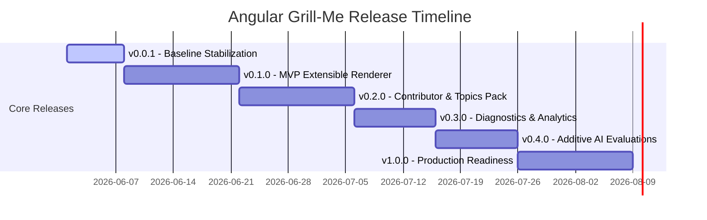

# Product Roadmap & Architectural Delivery Plan

This document defines the structured roadmap for **Angular Grill-Me**, evolving it from an offline evaluation prototype into a secure, accessible, high-validity knowledge-sharing platform.

---

## 🏗️ Architectural Separation of Concerns

To guarantee long-term maintenance and scaling, the codebase follows four strict architectural boundaries:

```
┌────────────────────────────────────────────────────────┐
│                   1. CONTENT SCHEMA                    │
│   (TypeScript interfaces, validations, metadata rules) │
└───────────────────────────┬────────────────────────────┘
                            ▼
┌────────────────────────────────────────────────────────┐
│                 2. RENDERING STRATEGY                  │
│  (Pluggable Renderer components, validation states)    │
└───────────────────────────┬────────────────────────────┘
                            ▼
┌────────────────────────────────────────────────────────┐
│                  3. EVALUATION ENGINE                  │
│  (Dynamic pattern checkers, scoring models, feedback)  │
└───────────────────────────┬────────────────────────────┘
                            ▼
┌────────────────────────────────────────────────────────┐
│                  4. PERSISTENCE LAYER                  │
│  (Filtered compression, local storage limits, history) │
└────────────────────────────────────────────────────────┘
```

1. **Content Schema**: Isolated definitions (`interview.models.ts`) and data registries (`quiz.data.ts`, `challenges.data.ts`). Static structures carry zero runtime or rendering logic.
2. **Rendering Strategy**: Pluggable UI strategies. Views bind exclusively to signals and don't manage assessment lifecycle operations.
3. **Evaluation Engine**: Grade execution models (`evaluation.service.ts`) that process student input against rubrics and return structured feedback.
4. **Persistence Layer**: State synchronization services (`state.service.ts`) managing serialization filter rules and quota safety.

---

## 🎯 Global User-Facing Success Criteria

To ensure we deliver value to both learners and contributors, success is measured against these key user-facing criteria:
* **For Learners**: A user can complete any topic quiz and receive a clear, actionable review detailing missing concepts and remediation recommendations to guide their study.
* **For Contributors**: A developer can add or extend a topic pack or question by writing static JSON/objects without writing component code, and have the content pass automated validation in CI.
* **For Operators**: The application runs completely serverless with safe defaults, protecting user state and degrading gracefully if external integrations are missing.

---

## 🗺️ Version Release Plan



### 1. `v0.0.1` — Baseline Stabilization (Released)
* **Goal**: Decouple state management, instantiate data-driven topic registries, and secure local storage against quota overflows.
* **Milestones**:
  - Extracted hardcoded quizzes and interactive puzzles from `StateService`.
  - Parameters and inline rubrics moved inside `quiz.data.ts` using `RubricMatcher` patterns.
  - Implemented 80%+ history serialization compression.
* **Success Metrics**:
  - **100%** of legacy storage entries migrated successfully.
  - Local storage payload reduced by **>80%** per session.

---

### 2. `v0.1.0` — MVP Extensible Renderer (Active)
* **Goal**: Build an extensible, strategy-based renderer supporting three core question types, establishing consistent validation and scoring reviews.
* **User Acceptance Criteria**:
  - A user can complete a topic quiz containing single-select, multi-select, and text questions, seeing exactly what they answered and where they need improvement.
* **Key Milestones**:
  - Establish a solid contract for `QuestionType` (`multiple-choice`, `open-ended`, `code-snippet`, `select-all`).
  - Implement a generic host `QuestionRendererComponent` using a strategy switcher pattern.
  - Implement accessible sub-renderers:
    - `McqRenderer` (single-select radio cards).
    - `SelectAllRenderer` (multi-select check lists).
    - `TextRenderer` (dual-mode text area for open-ended and code snippets).
  - Unify validation states (e.g. check validation constraints before enabling "Next").
  - Redesign review and explanation panels to show exact options corrections and scoring criteria.
* **Release Criteria & Metrics**:
  - **100%** of core quiz flows complete with zero JavaScript runtime errors.
  - Layout adapts fluidly on mobile devices down to **320px** wide.
  - *Performance targets (aspirational)*: Interaction to Next Paint (INP) under **16ms** and initial boot time under **1.5s** on a representative mid-range baseline mobile device.

---

### 3. `v0.2.0` — Contributor Experience & Topic Packs
* **Goal**: Expand core topics, publish contribution guidelines, and implement a secure, schema-validated registry loader.
* **User Acceptance Criteria**:
  - Contributors can author and plug in new topics using static TypeScript data files without modifying component code or styling assets.
* **Key Milestones**:
  - Add **Angular Router**, **Advanced Forms**, and **Zoneless Optimization** topic packs.
  - Write a developer-facing `CONTRIBUTING_CONTENT.md` guide outlining how to add questions, write regex rubrics, and structure coding challenges.
  - **Content Validation Schema**: Run validation tests in CI checking option indices, topic IDs, and regex patterns for syntax errors.
  - **Plugin Security & Fallbacks**: Implement a registry loader with strict schema validation. Untrusted or malformed content is rejected in favor of safe local defaults.
* **Release Criteria & Metrics**:
  - Zero code modifications required to register a new topic pack.
  - CI validator detects and rejects **100%** of malformed schema inputs (e.g., correct index out of options bounds).

---

### 4. `v0.3.0` — Diagnostics & Content Validity
* **Goal**: Implement remediation suggestions, track mastery progression, and validate rubric/scoring calibration.
* **User Acceptance Criteria**:
  - A user sees study recommendations linking to external references for every concept they missed.
* **Key Milestones**:
  - Track topic mastery over time based on historical quizzes and playground achievements.
  - **Guided Remediation**: Add links to official docs/reference material associated with specific rubric patterns.
  - **Content Validity Calibration**: Validate question difficulty and rubric criteria. Conduct human reviews of sample answers against regex checkers to verify grading reliability.
  - Introduce partial-credit grading: score responses proportionally if only some rubric matches are met.
* **Release Criteria & Metrics**:
  - Scoring evaluations achieve **90%+** agreement with expert human review on a test set of student responses.
  - Remediation engine suggests matching study links in **100%** of failed question reviews.

---

### 5. `v0.4.0` — Additive AI Evaluations
* **Goal**: Add optional, non-blocking AI-powered grading support for rich technical explanations.
* **User Acceptance Criteria**:
  - A user can optionally toggle AI analysis to get semantic feedback on their written responses without affecting the core local grade.
* **Key Milestones**:
  - Integrate an optional cloud-based scoring adapter (e.g. Gemini Pro / Firebase AI logic).
  - Treat AI evaluation as a secondary overlay that runs asynchronously without blocking the local rubric score.
  - Show side-by-side AI commentary highlighting missing conceptual nuances and code improvements.
* **Plugin Safety & Fallback**:
  - Fail-safe network behavior: if the external API is unreachable or has invalid configuration, the application gracefully degrades to local regex rubrics with zero interruption.
* **Release Criteria & Metrics**:
  - Network timeouts and authentication errors result in **0** application crashes.
  - Average AI response overlay latency is under **3 seconds** on standard mobile networks.

---

### 6. `v1.0.0` — Production Polish
* **Goal**: Deliver a highly accessible, offline-capable, enterprise-quality web application.
* **User Acceptance Criteria**:
  - The application works completely offline and is fully usable via keyboards and screen readers.
* **Key Milestones**:
  - Conduct full keyboard and screen reader accessibility checks (WCAG 2.2 AA alignment).
  - Implement Service Worker caching rules for PWA capability, enabling fully offline preparation.
  - Write complete Playwright E2E suites verifying critical workflows (taking a quiz, finishing a coding challenge, viewing history).
* **Release Criteria & Metrics**:
  - **95+** Lighthouse scores for SEO, Best Practices, and Accessibility.
  - E2E tests achieve **100%** coverage of core user flows.
