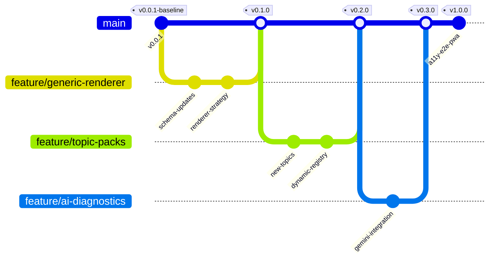

# Angular Grill-Me Roadmap & Release Plan

This document outlines the evolutionary roadmap for **Angular Grill-Me**, tracing the journey from the baseline architectural refactor to the ultimate production-ready platform.

---

## 🗺️ Versioning Summary

| Version | Focus Area | Status | Key Deliverables |
|:---|:---|:---|:---|
| **v0.0.1** | Architectural Foundation & Decoupling | **Released** | Decoupled content layer, parameterized local rubric evaluators, compressed storage footprint (80%+ compression). |
| **v0.1.0** | Extensible Question Types & Generic Renderer | *In Progress* | Multi-select (`select-all`), Scenario cards, Drag-and-drop schemas, Dynamic component-based renderer strategy. |
| **v0.2.0** | Topic Packs & Dynamic Challenge Extensions | *Planned* | Router, Forms, and PWA topic packs; dynamic plugin loader registry. |
| **v0.3.0** | AI-Powered Diagnostics | *Planned* | Native Google Gemini API evaluation, detailed feedback cards, localized diagnostics report exporter. |
| **v1.0.0** | Production Suite | *Planned* | Playwright E2E suites, full WCAG 2.2 a11y alignment, PWA offline capabilities. |

---

## 🚀 Release Breakdown

### v0.0.1 — Architectural Foundation (Baseline Released)
The current stable baseline. Focuses on separating state management from static quiz/challenge registries and optimizing localStorage to prevent 5MB limit failures.
- **Key Milestones**:
  - Extracted questions and coding puzzles into `/src/app/data/`.
  - Introduced `RubricMatcher` dynamic regex grading engine.
  - Implemented metadata-only serialization to shrink save footprints by over 80%.

### v0.1.0 — Extensible Schema & Generic Renderer (Active Target)
Move away from hardcoded quiz/MCQ templates to a modular rendering architecture.
- **Key Milestones**:
  - Refactor `QuestionType` to fully support `'multiple-choice' | 'open-ended' | 'code-snippet' | 'select-all' | 'drag-and-drop'`.
  - Build a generic, pluggable `QuestionRendererComponent` directive/strategy switcher.
  - Refactor `topic-matrix.ts` to dynamically delegate rendering to individual strategy sub-components (e.g. `McqRenderer`, `SelectAllRenderer`, `TextRenderer`, `ScenarioCardRenderer`).
  - Introduce validation states and custom option layouts.

### v0.2.0 — Topic Expansion & Plugin System
Make it trivial for community developers to contribute new topics or coding challenges.
- **Key Milestones**:
  - Add **Angular Router**, **Advanced Reactive Forms**, and **Performance/Zoneless Tuning** topic packs.
  - Create a plugin loader system that dynamically fetches or imports third-party topic registries without touching core project code.

### v0.3.0 — AI-Powered Screening & Diagnostics
Incorporate advanced local and cloud-based evaluations.
- **Key Milestones**:
  - Streamline Firebase/Gemini AI integration inside the screening room.
  - Grade complex design pattern answers with AI.
  - Provide a visual readiness matrix report that users can export to PDF.

### v1.0.0 — Production-Ready Suite
Finalize user experience, accessibility, and automated quality assurance.
- **Key Milestones**:
  - Implement full keyboard controls and screen reader accessibility checks (WCAG 2.2 AA).
  - Add comprehensive automated coverage via Playwright E2E tests.
  - Enable service workers for PWA offline accessibility (allowing users to prepare for interviews offline).
