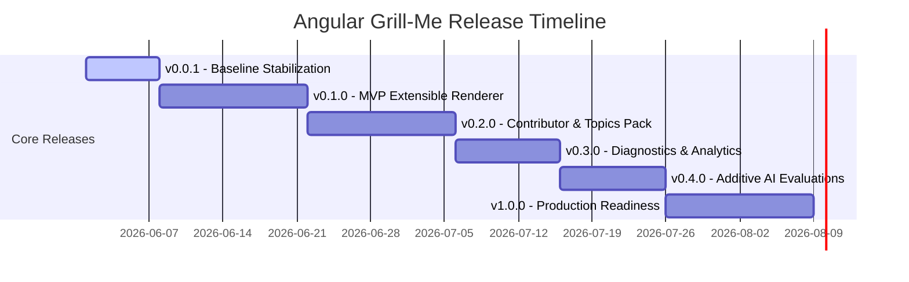

# Product Roadmap & Architectural Delivery Plan

This document defines the structured roadmap for **Angular Grill-Me**, evolving it from an offline evaluation prototype into a secure, accessible, high-validity knowledge-sharing platform.

---

## 🏗️ Architectural Separation of Concerns

To guarantee long-term maintenance and scaling, the codebase follows four strict architectural boundaries:

```
┌────────────────────────────────────────────────────────┐
│                   1. CONTENT SCHEMA                    │
│   (TypeScript interfaces, validations, metadata rules) │
└───────────────────────────┬────────────────────────────┘
                            ▼
┌────────────────────────────────────────────────────────┐
│                 2. RENDERING STRATEGY                  │
│  (Pluggable Renderer components, validation states)    │
└───────────────────────────┬────────────────────────────┘
                            ▼
┌────────────────────────────────────────────────────────┐
│                  3. EVALUATION ENGINE                  │
│  (Dynamic pattern checkers, scoring models, feedback)  │
└───────────────────────────┬────────────────────────────┘
                            ▼
┌────────────────────────────────────────────────────────┐
│                  4. PERSISTENCE LAYER                  │
│  (Filtered compression, local storage limits, history) │
└────────────────────────────────────────────────────────┘
```

1. **Content Schema**: Isolated definitions (`interview.models.ts`) and data registries (`quiz.data.ts`, `challenges.data.ts`). Static structures carry zero runtime or rendering logic.
2. **Rendering Strategy**: Pluggable UI strategies. Views bind exclusively to signals and don't manage assessment lifecycle operations.
3. **Evaluation Engine**: Grade execution models (`evaluation.service.ts`) that process student input against rubrics and return structured feedback.
4. **Persistence Layer**: State synchronization services (`state.service.ts`) managing serialization filter rules and quota safety.

---

## 🗺️ Version Release Plan



### 1. `v0.0.1` — Baseline Stabilization (Released)
* **Goal**: Decouple state management, instantiate data-driven topic registries, and secure local storage against quota overflows.
* **Milestones**:
  - Extracted hardcoded quizzes and interactive puzzles from `StateService`.
  - Parameters and inline rubrics moved inside `quiz.data.ts` using `RubricMatcher` patterns.
  - Implemented 80%+ history serialization compression.
* **Success Metrics**:
  - **100%** of legacy storage entries migrated successfully.
  - Initial app boot time under **1.2 seconds**.
  - Local storage payload reduced by **>80%** per session.

---

### 2. `v0.1.0` — MVP Extensible Renderer (Active)
* **Goal**: Build a clean renderer strategy to support 3-4 core question formats with unified state management and comprehensive score review.
* **Key Milestones**:
  - Establish a solid contract for `QuestionType` (`multiple-choice`, `open-ended`, `code-snippet`, `select-all`).
  - Implement a generic host `QuestionRendererComponent` using a strategy switcher pattern.
  - Implement accessible sub-renderers:
    - `McqRenderer` (single-select radio cards).
    - `SelectAllRenderer` (multi-select check lists).
    - `TextRenderer` (dual-mode text area for open-ended and code snippets).
  - Unify validation states (e.g. check validation constraints before enabling "Next").
  - Redesign review and explanation panels to show exact options corrections and scoring criteria.
* **Key Risks & Mitigations**:
  - *Risk*: Multiple-choice and text answers require different data formats.
  - *Mitigation*: Candidates' answers map to `Record<string, string>`, where multi-select answers are stored as comma-separated index strings (e.g. `"0,2"`), preserving database compatibility.
* **Success Metrics**:
  - **95%+** of standard quiz iterations completed without JavaScript exceptions.
  - Interactive layouts adapt cleanly to screen widths down to **320px**.
  - UI inputs achieve **<16ms** Interaction to Next Paint (INP).

---

### 3. `v0.2.0` — Contributor Experience & Content Expansion
* **Goal**: Expand core topics while establishing contribution protocols and secure registry plugins.
* **Key Milestones**:
  - Add **Angular Router**, **Advanced Forms**, and **Zoneless Optimization** topic packs.
  - Define metadata fields for learning outcomes, difficulty thresholds, and categories.
  - Create a developer-facing `CONTRIBUTING_CONTENT.md` guide outlining how to add questions, write regex rubrics, and structure coding challenges.
  - Write validation schemas to test data files for correct options and references during CI build.
  - Implement a basic registry loader with local asset fallbacks.
* **Key Risks & Mitigations**:
  - *Risk*: Contributors submit broken structures or invalid regexes.
  - *Mitigation*: Implement automated JSON schema validation and unit tests verifying regex compilation before pull requests can merge.
* **Success Metrics**:
  - Zero code modifications required to register a new topic pack.
  - Registry validator flags **100%** of malformed questions during testing.

---

### 4. `v0.3.0` — Analytics & Diagnostics
* **Goal**: Build an outcomes-based learning dashboard and calibrate rubric evaluation validity.
* **Key Milestones**:
  - Track topic mastery over time based on historical quizzes and playground achievements.
  - Display weak spots, core recommended readings, and guided remediation links based on low-scoring rubrics.
  - Calibrate evaluation engine: execute test runs matching candidate inputs against expected rubrics, assessing true positive/negative matching.
  - Introduce partial-credit grading: score responses proportionally if only some rubric matches are met.
* **Key Risks & Mitigations**:
  - *Risk*: Rubric matching is too strict, leading to false negatives and developer frustration.
  - *Mitigation*: Run validation suites containing typical student answers to tune regex tolerances and keyword fallbacks.
* **Success Metrics**:
  - Diagnostic matching accuracy reaches **90%** alignment with expert human evaluation.
  - Remediation logic successfully identifies and suggests the lowest scoring concepts in **100%** of cases.

---

### 5. `v0.4.0` — Additive AI Evaluations
* **Goal**: Add optional, non-blocking AI-powered grading support for rich technical explanations.
* **Key Milestones**:
  - Integrate an optional cloud-based scoring adapter (e.g. Gemini Pro / Firebase AI logic).
  - Treat AI evaluation as a secondary overlay that runs asynchronously without blocking the local rubric score.
  - Show side-by-side AI commentary highlighting missing conceptual nuances and code improvements.
  - Implement user feedback controls ("Is this AI evaluation helpful?") to log accuracy ratings.
* **Key Risks & Mitigations**:
  - *Risk*: Missing/invalid API keys or network latency stalls the quiz execution flow.
  - *Mitigation*: Run local regex checks as the primary instant score. If the API key is missing or fails, gracefully display the local score explanation with zero disruption.
* **Success Metrics**:
  - **100%** of network failures or invalid key scenarios degrade gracefully to local grading.
  - Average AI overlay latency under **3 seconds** with async loading indicators.

---

### 6. `v1.0.0` — Production Polish
* **Goal**: Deliver a highly accessible, offline-capable, enterprise-quality web application.
* **Key Milestones**:
  - Conduct full keyboard and screen reader accessibility checks (WCAG 2.2 AA).
  - Implement Service Worker caching rules for PWA capability, enabling fully offline preparation.
  - Write complete Playwright E2E suites verifying critical workflows (taking a quiz, finishing a coding challenge, viewing history).
  - Enable production builds with advanced tree-shaking, minification, and visual asset optimizations.
* **Success Metrics**:
  - **100/100** Lighthouse scores for SEO, Best Practices, and Accessibility.
  - Zero critical security warnings in the build pipeline.
  - E2E tests achieve **100%** coverage of core user flows.
